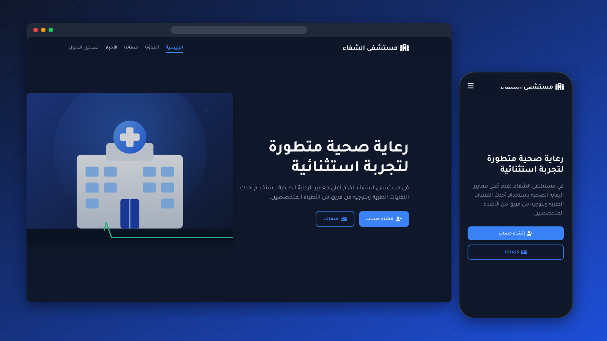

<div align="center">

# 🏥 Al-Shifa Hospital · مستشفى الشفاء

**A responsive Arabic (RTL) hospital website with light and dark themes.**

[](https://mo1amin.github.io/shifa-hospital-website/)




</div>

## ✨ Features

- **Six pages:** home, services, doctors, news, sign-in and registration
- **Light and dark mode** with the choice remembered in `localStorage`
- **Right-to-left layout** for Arabic, using the Tajawal font
- **Responsive:** a mobile menu, and layouts that fit any screen with no sideways scrolling
- **Form validation** on sign-in and registration, with messages in Arabic
- **Details:** entrance animations, a scroll-to-top button and a custom cursor

> The sign-in and registration pages are a front-end demo; there is no server behind them.

## 🗂 Structure

```
index.html        Home
services.html     Services
doctors.html      Doctors (rendered from a data list)
news.html         News
Login.html        Sign in
register.html     Registration
style.css         Theme tokens, layout and components
js/               theme, animations, form validation, navigation
images/           Illustrations and doctor avatars
```

## ▶️ Run it

No build step. Open `index.html` in a browser, or serve the folder:

```bash
npx serve .
```

---

<div align="center">Made by <a href="https://github.com/Mo1Amin">Mohamed Amin</a></div>
